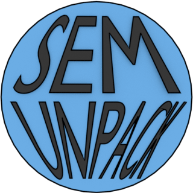

<!-- badges: start -->
[](https://lifecycle.r-lib.org/articles/stages.html#experimental)
[](https://www.repostatus.org/#wip)
[](https://github.com/sfcheung/semunpack)
[](https://github.com/sfcheung/semunpack/commits/main)
[](https://github.com/sfcheung/semunpack/actions/workflows/R-CMD-check.yaml)
<!-- badges: end -->

(Version 0.0.1.9007), updated on 2023-03-11, [release history](https://sfcheung.github.io/semunpack/news/index.html))

# semunpack: Learn SEM Analysis 

This package includes functions for learning and teaching structural equation
modeling (SEM). It "unpacks" things inside an SEM analysis. For more information
on this package, please visit its GitHub page:

https://sfcheung.github.io/semunpack/

# Installation

Stable release versions of this package can be downloaded below:

https://github.com/sfcheung/semunpack/releases

The latest developmental version of this package can be installed by `remotes::install_github`:

```r
remotes::install_github("sfcheung/semunpack")
```

# Issues

If you have any suggestions and found any bugs, please feel
feel to open a [GitHub issue](https://github.com/sfcheung/semunpack/issues). Thanks.
